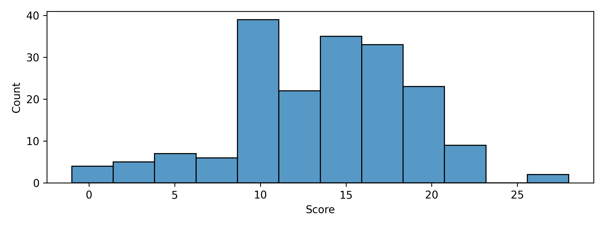
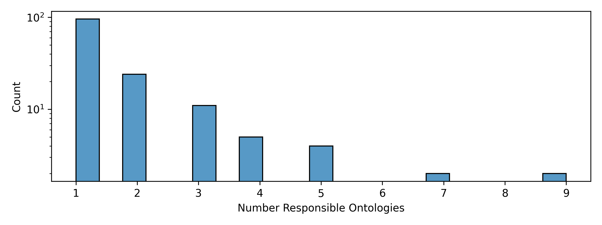

# obo-community-health

This repository contains code for downloading the OBO Foundry and assessing the
completeness, correctness, and goodness of each ontology's metadata. The
assessment is highly opinionated, but fills in several huge gaps in the current
OBO Foundry pipeline for assessing the completeness and utility of metadata
given by submitters as well as keeping track and pointing out obviously
abandoned efforts.

## Pages

### Ontology View

The [ontology view](https://cthoyt.github.io/obo-community-health/) gives
insight into which OBO Foundry ontologies are actively being updated and have
appropriate metadata.

### Contact View

The [contacts view](https://cthoyt.github.io/obo-community-health/contacts)
gives insight into who is responsible for each OBO Foundry ontology, how easy
they are to get in contact with, and whether they are actually actively
participating in GitHub (e.g., this shows there are several people who have
completely shirked responsibility).

## Why Does this Exist?

I wanted quantitative metrics to propose ontologies to be marked as abandoned on
the OBO Foundry. Suggesting to mark ontologies as abandoned has a huge risk of
hurting people's feelings, so I hope that having quantitative metrics
demonstrating the following on many ontologies could help the process:

1. lack of engagement of users
2. lack of engagement maintainers
3. lack of conformance to required metadata based on OBO standards
4. lack of obviously useful metadata (for which the OBO community is slow to
   impose requirements)

Secondarily, this demonstrates how simple (less than 300 or so lines) a script
that performs checks for OBO metadata standards (such as requiring a homepage)
could be written.

## Build

Check the OBO Foundry repositories to see what's going on. To run this, you'll
need either the `GITHUB_TOKEN`
environment variable set up with a github token, or any other valid way to
specify the `token` key in the `github`
namespace via [`pystow`](https://github.com/cthoyt/pystow). Installation and
running is handled with `tox`. Run with the following lines in your shell:

```shell
$ pip install tox
$ tox
```

For a non-standard build using a bleeding edge build of the OBO Foundry config,
use:

```shell
python build_contacts.py --path ~/dev/OBOFoundry.github.io/_config.yml
python build.py --path ~/dev/OBOFoundry.github.io/_config.yml --force 
```

## Charts

This repository implements a highly opinionated scoring system. Here's a summary
of the distribution of scores across the OBO Foundry



How divided is responsibility across all ontologies?



## Embed

The [Bioregistry](https://bioregistry.io) provides a wrapper around the
[Shields.io](https://shields.io/) badge generation service to make beautiful
badges showing off the community health of your ontology, like
<object data="https://bioregistry.io/health/go"></object>.

You can embed the score of your resource using the following HTML using
your prefix (e.g., `go`) in place of `<YOUR PREFIX HERE>`:

```html

<object data="https://bioregistry.io/health/<YOUR PREFIX HERE>"></object>
```

More simply, it can be embedded as an image, but this doesn't auto-generate a
link:

```html
"/>
```
